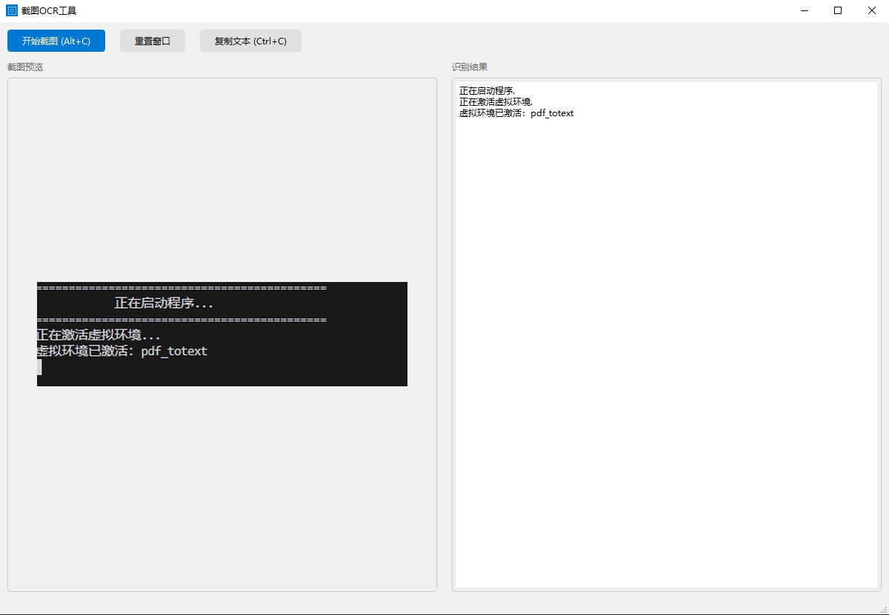

# Screenshot Text Extraction Tool | 屏幕截图，文字提取工具

A simple screenshot OCR tool with hotkey support and multi-language recognition.

一个简单易用的屏幕截图文字提取工具，支持快捷键操作和中英文识别。

## Preview | 预览



## Features | 功能特点

- 简洁的图形界面 | Clean and intuitive interface
- 快捷键支持 | Hotkey support
  - Alt+C：快速截图 | Quick screenshot
  - Ctrl+C：复制文本 | Copy text
- 鼠标框选截图 | Mouse selection for screenshot
- 实时预览 | Real-time preview
- 中英文识别 | Multi-language recognition
- 系统托盘功能 | System tray support
  - 快速访问常用功能 | Quick access to common features
  - 最小化到托盘 | Minimize to tray
- 窗口位置记忆 | Window position memory
- 状态栏提示 | Status bar notifications
- OCR结果过滤 | OCR result filtering
  - 置信度过滤 | Confidence threshold filtering

## Project Structure | 项目结构

```
text_extraction/
├── src/                  # 源代码
│   ├── ui/              # 用户界面相关
│   │   ├── main_window.py     # 主窗口类
│   │   └── screenshot_overlay.py  # 截图覆盖层
│   ├── utils/           # 工具函数
│   │   └── icon_manager.py    # 图标管理
│   ├── ocr/             # OCR相关
│   │   └── paddle_ocr.py      # OCR处理器
│   └── main.py          # 程序入口
├── requirements.txt     # 依赖文件
├── setup.bat           # 环境配置脚本
├── env.bat             # 环境激活脚本
└── run.bat             # 运行脚本
```

## Requirements | 环境要求

- Windows 10/11
- Python 3.10
- [Visual C++ Redistributable](https://aka.ms/vs/17/release/vc_redist.x64.exe)

## Installation | 安装步骤

1. 创建虚拟环境（推荐）| Create virtual environment (recommended)：
```bash
conda create -n pdf_totext python=3.10
conda activate pdf_totext
```

2. 运行环境配置脚本 | Run setup script：
   - 双击运行 `setup.bat`
   - 脚本会自动：
     - 检查 Python 版本
     - 安装 Visual C++ Redistributable（如果需要）
     - 激活虚拟环境
     - 安装所需依赖

## Usage | 使用方法

1. 启动程序 | Start the program：
   - 双击 `run.bat`
   - 或在命令行中运行：`python src/main.py`

2. 截图操作 | Screenshot operations：
   - 点击"开始截图"按钮或按 `Alt+C`
   - 按住左键拖动选择区域
   - 释放左键完成截图
   - 右键或 ESC 键取消

3. 文本操作 | Text operations：
   - 截图完成后自动识别文字
   - 点击"复制文本"按钮或按 `Ctrl+C` 复制结果
   - 状态栏会显示操作结果

4. 窗口操作 | Window operations：
   - 可以调整窗口大小
   - 点击"重置窗口"恢复默认大小
   - 窗口位置会自动保存

5. 系统托盘 | System tray：
   - 可以最小化到系统托盘
   - 右键托盘图标可以：
     - 开始截图
     - 复制文本
     - 重置窗口
     - 退出程序

## Notes | 注意事项

1. 首次运行时会自动下载OCR模型文件 | OCR model will be downloaded automatically on first run
2. 确保安装了正确版本的Visual C++ Redistributable | Make sure correct version of Visual C++ Redistributable is installed
3. 如果快捷键冲突，可以修改源码中的快捷键设置 | If hotkey conflicts, you can modify it in source code

## Feedback | 问题反馈

如果遇到问题或有改进建议，可以通过以下方式联系：
If you encounter any issues or have suggestions, please contact: 853174787@qq.com
